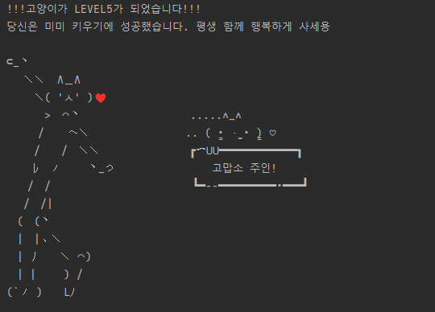

# Meow Life

---

## 프로젝트 소개
- 스프링을 이용한 텍스트 기반 고양이 키우기 프로젝트

<br>

---

## 요구사항
- 기능별로 각각의 상황을 테스트하는 코드를 구현한다.
- MVC 패턴을 활용하여 코드를 간소화한다.

### *고양이*
  #### 공통 스탯
    에너지
    몸무게
    경험치

    기본 에너지 50 (max 100)
    기본 몸무게 1kg (max 10)
    기본 경험치 0(max 100, 100 초과시 레벨업, 레벨업 시 초기화)
    기본 레벨 1 (max 5)


### *유저*
    아이디
    비밀번호
    사용자 이름


### *구현 기능*
#### 메인 콘솔
- 회원가입, 로그인, 프로그램 종료 콘솔

```java
Scanner in = new Scanner(System.in);

System.out.print("기능을 선택해주세요 : ");
int select = in.nextInt();

switch(select){
    case 1 : 회원가입(); break;
    case 2 : 로그인(); break;
    case 9 : break;
}

```
- 프로그램 종료
  - 9번을 입력하면 프로그램이 종료되게끔 구현

```java
  if(select == 9){
    break;
  }
```


<br>


- 회원가입
  1. 아이디, 비밀번호, 사용자 이름을 입력받는다.
  ```java
  boolean status = true;
  while(status){
    try{
      회원 가입 기능...
      status = false;
      }
  
    // 실패시 예외처리 후 반복..
    catch(IllegalArgumentException e){
    ...
    }
  }
  ``` 
  > boolean status를 설정한다. 회원가입 코드를 while문으로 감싸고 수행이 완료되면 status를 false로 초기화하여 종료


<br>

  2. 아이디가 중복일 시, `"아이디가 중복됩니다.. 다시 입력해주세요"` 출력 후 다시 회원가입 콘솔로 이동 
  > 중복일 시 IllegalArgumentException() 예외를 던지도록 한다.

<br>

- 로그인
  1. 아이디, 비밀번호를 입력한다.
  2. 아이디와 비밀번호가 유저 DB와 일치하는지 확인 후 완료되면 고양이 키우기 콘솔로 이동
    - 로그인 실패시 회원가입에서 while(status)를 받은것처럼 똑같이 무한반복되게 한다.
  ```java
  boolean status = true;
    while(status){
    try{
    로그인 기능...
    status = false;
    }
    
    // 실패시 예외처리 후 반복..
    catch(IllegalArgumentException e){
    ...
    }
  }
  ```
  
<br>

---
## 고양이 콘솔 (로그인 성공)

1. 고양이가 있는지 없는지 확인 후 없으면 고양이 선택 메소드로 이동, 있으면 바로 고양이 키우기 메소드로 이동
2. 고양이 선택 메소드

```java
import java.util.Scanner;

public class CatSelect() {
  public void catSelect() {
    Scanner sc = new Scanner(System.in)
    System.out.print("키울 고양이의 종을 입력해주세요(코숏, 노르웨이숲, 러시안블루) : ");
    String cat = sc.nextLine();

    System.out.print("고양이의 이름을 입력해주세요 : ");
    String catName = sc.nextLine();
    
    if("코숏".equals(cat)){
        코숏 고양이 생성(catName);
    }
    ... // 나머지 고양이도 동일하게 생성
  }
}

```

3. 고양이 생성 끝나면 고양이 키우기 메소드로 이동

<br>

4. 고양이 키우기 메소드 호출 시 기능 선택   
  - [1] 밥 먹기 [2] 잠자기 [3] 놀기
  - 기능 선택 시 종에 따라 위에서 언급한 에너지, 몸무게 소모/증가하도록 설정
  - 현재 고양이의 상태 (에너지, 몸무게, 경험치, 레벨) 출력(기능 수행시 지속적으로 업데이트)
  - 경험치가 100이 되면 레벨업
  - 레벨 5 && 경험치 100 이상 시 굿엔딩
  - 특정 조건 만족 시 배드엔딩




<br>

### *엔딩*
#### 굿엔딩
- `고양이가 사람이 되었습니다! 서로 결혼하여 행복하게 잘 살았습니다 ~~` 출력. 해당 고양이 객체 삭제

<br>

#### 배드엔딩
1. 몸무게 0.5 이하 || 에너지 0 이하
- `단체에 신고당하여 무기 징역 선고. 고양이는 다른 주인을 만나 행복하게 살았답니다~` 출력 후 종료. 해당 고양이 객체 삭제

2. 몸무게 10kg 초과
- `고양이 확대 혐의로 단체에 신고당하여 무기 징역 선고. 다른 주인 만나 다이어트 성공 후 결혼 성공~` 출력 후 종료. 해당 고양이 객체 삭제

---

## 제약사항
- 다중 if문 구조일 경우 `early return`을 사용하여 코드를 가독성 및 효율성 있게 작성할 것
- 메소드 이름은 반드시 명령문 형태로 작성
- 테스트 메소드는 충분히 기능을 검증하도록 작성
- 개인 구현은 반드시 브랜치를 생성 후 구현할 것
  **(브랜치 이름은 신규인 경우 feature/기능명 형태로 작성할 것)**
- 모든 개인 작업이 끝난 후 PR 생성
- PR에 모든 팀원이 코드 리뷰할 것
- 마지막 리뷰어는 Merge 수행


