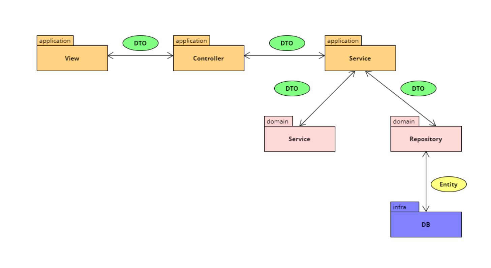

# Meow Life

---

## 프로젝트 소개
- 스프링을 이용한 텍스트 기반 고양이 키우기 프로젝트
- 메인화면은 `회원가입`, `로그인`, `프로그램 종료`으로 구성
- 사용자가 키울 수 있는 고양이는 3가지
- 배드엔딩 2개, 해피엔딩 1개
- 고양이의 행동은 `잠자기`, `밥먹기`, `놀기`로 구성
- 각 행동마다 고양이의 스탯이 증가하거나 감소

 

## 요구사항
- 기능별로 각각의 상황을 테스트하는 코드를 구현한다.
- MVC 패턴을 활용하여 코드를 간소화한다.

### *고양이*
#### 공통 스탯
    에너지
    몸무게
    경험치

    기본 에너지 50 (max 100)
    기본 몸무게 2kg (max 10)
    기본 경험치 0(max 100, 100 초과시 레벨업, 레벨업 시 초기화)
    기본 레벨 1 (max 5)

### *유저*
    아이디
    비밀번호
    사용자 이름

### *구현 기능*
#### 메인 콘솔
- 회원가입, 로그인, 프로그램 종료 콘솔

 

- 회원가입
  1. 아이디, 비밀번호, 사용자 이름을 입력받는다.

 

2. 아이디가 중복일 시, `"아이디가 중복입니다. 다시 입력해주세요"` 출력 후 다시 회원가입 콘솔로 이동
   - 아이디와 비밀번호는 영문과 숫자로만 이루어져있다. 
> 예외처리는 IllegalArgumentException()으로 한다.   

 

- 로그인
  1. 아이디, 비밀번호를 입력한다.
  2. 로그인 플레이어가 고양이를 가지고 있지 않으면 고양이를 생성하고 그렇지 않으면 다음으로 넘어간다.
  3. 아이디와 비밀번호가 유저 DB와 일치하는지 확인 후 완료되면 고양이 키우기 화면으로 이동

 

---
## 고양이 콘솔 (로그인 성공)

1. 고양이가 있는지 없는지 확인 후 없으면 고양이 선택 메소드로 이동, 있으면 바로 고양이 키우기 메소드로 이동
2. 고양이 선택 메소드

3. 고양이 생성 끝나면 고양이 키우기 메소드로 이동

 

4. 고양이 키우기 메소드 호출 시 기능 선택
- [1] 잠자기 [2] 밥먹기 [3] 놀기
- 기능 선택 시 종에 따라 위에서 언급한 에너지, 몸무게 소모/증가하도록 설정
- 현재 고양이의 상태 (에너지, 몸무게, 경험치, 레벨) 출력(기능 수행시 지속적으로 업데이트)
- 에너지가 30 이하 일 때 경고 출력
- 몸무게 1kg 이하 or 9kg 이상 시 경고 출력
- 경험치가 100 이상 시 레벨업
- 특정 조건 만족 시 배드엔딩 및 해피엔딩

 

### *엔딩*
#### 해피엔딩
- `고양이가 사람이 되었습니다! 서로 결혼하여 행복하게 잘 살았습니다 ~~` 출력. 해당 고양이 객체 삭제

 

#### 배드엔딩
1. 몸무게 0.5 이하 || 에너지 0 이하
- `단체에 신고당하여 무기 징역 선고. 고양이는 다른 주인을 만나 행복하게 살았답니다~` 출력 후 종료. 해당 고양이 객체 삭제

2. 몸무게 10kg 초과
- `고양이 확대 혐의로 단체에 신고당하여 무기 징역 선고. 다른 주인 만나 다이어트 성공 후 결혼 성공~` 출력 후 종료. 해당 고양이 객체 삭제

> 엔딩 화면 출력 이후 다시 고양이를 생성할 수 있다.

 

---
## 프로젝트 아키텍처

### - 패키지 구조

 

### - CI/CD

 

---

## 제약사항
- 다중 if문 구조일 경우 `early return`을 사용하여 코드를 가독성 및 효율성 있게 작성할 것
- 메소드 이름은 반드시 명령문 형태로 작성
- 테스트 메소드는 충분히 기능을 검증하도록 작성
- 개인 구현은 반드시 브랜치를 생성 후 구현할 것
- **(브랜치 이름은 신규인 경우 feature/기능명 형태로 작성할 것)**   
- **(버그 수정의 경우 bugfix/기능명 형태로 작성할 것)**
- 모든 개인 작업이 끝난 후 PR 생성
- PR에 모든 팀원이 코드 리뷰할 것
- 마지막 리뷰어는 Merge 수행

